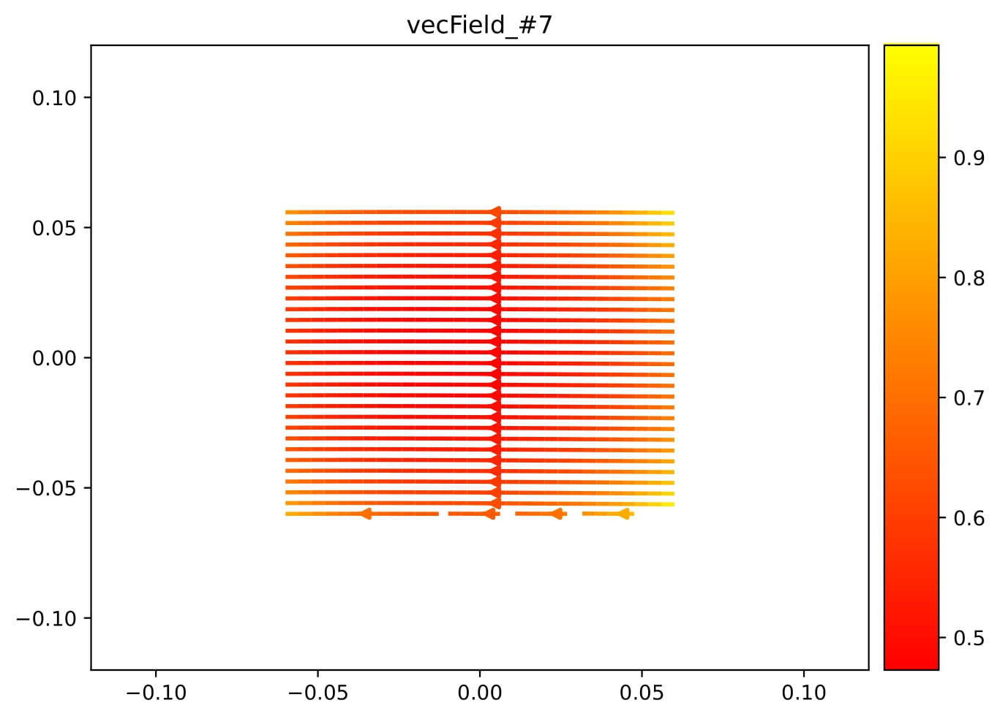
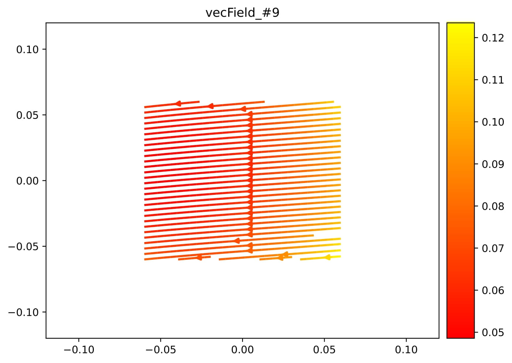

# Learning Lie Groups Acting on the Manifolds Generated by Linear Differential Equations (DEs)

This repo is created for providing supplementary documents and the code.

## Learned Vector Fields for Wave Equation in 2-D

Wave equation in $2$-D is $u_{tt}-c^2(u_{xx}+u_{yy}) = 0$, where $c=3.0$ in this experiment. Since prolonged space $\mathcal{P}$ is of $13$-D for this equation and it is comprised of 1 DE, its manifold, $\mathcal{N}$, is of $12$-D. Moreover, it is of $12$-D everywhere in $\mathcal{P}$, because it is a linear DE. 

Since each vector field $X_j \in \mathfrak{g}$ lives in a $13$-D space, we canonically project them onto $x-y$ plane, and then display them as shown in the following table, where $\mathfrak{g}$ is the Lie algebra associated with wave equation in $2$-D. The first vector field is the one associated with arbitrary solution, $\alpha(x, y, t)$, as specified in the article. Thus, we display its graph $\alpha(x, y, t_0)$ with $t_0=0.08$ rather than its projection onto $x-y$ plane.

<table style="border:0px">
  <tr align="center" style="border: 0px">
    <td align="center" style="border: 2px">
      
    </td>
    <td align="center" style="border: 2px">
      
    </td>
    <td align="center" style="border: 0px">
       
    </td>
  </tr>
  <tr align="center" style="border: 0px">
    <td align="center" style="border: 2px">
      
    </td>
    <td align="center" style="border: 2px">
      
    </td>
    <td align="center" style="border: 0px">
       
    </td>
  </tr>
  <tr align="center" style="border: 0px">
    <td align="center" style="border: 2px">
      
    </td>
    <td align="center" style="border: 2px">
      
    </td>
    <td align="center" style="border: 0px">
       
    </td>
  </tr>
  <tr align="center" style="border: 0px">
    <td align="center" style="border: 2px">
      
    </td>
    <td align="center" style="border: 2px">
      
    </td>
    <td align="center" style="border: 0px">
       
    </td>
  </tr>
</table>

## Reconstructing Canonical Vector Field from $\mathfrak{g}$

Any canonical vector field, $X_{can}$, for wave equation in 2-D has to be in the span of $\lbrace\mathfrak{g}_j \\ \vert \\ j=1,\dotsc, \text{dim}\(\mathfrak{g})=r\rbrace$, i.e.

$$ X_{can}\vert_{\alpha_i(t)=p} = \sum_{j=1}^r \sum_{k=1}^m \beta^j_i(t) X_j^k\vert_p, \\ p \in \mathcal{N}, $$

where $\mathcal{N}$ is the manifold defined by wave equation in $2$-D, $\lbrace\beta^j(t)\rbrace_{j=1}^r$ are learnable coefficient functions, $\lbrace X_j \rbrace_{j=1}^r$ are right invariant and linearly independent vector fields spanning $\mathfrak{g}$, which are already learned, $t \in \mathbb{R}$ is the parameter defining $X_{can}$, and $\alpha_i(t)$ is the $i^{th}$ integral curve for $X_{can}$. In this experiment, we set $X_{can}$ to be the ***rotation in x-y plane***, which is one of twelve canonical symmetries pertaining to wave equation in $2$-D:

$$
X_{R_{\text{xy}}} = 
  \begin{bmatrix}
    0.0, & -1.0, & 0.0, & 0.0, & 0.0, & 0.0, & 0.0, & 0.0, & 0.0, & 0.0, & 0.0, & 0.0, & 0.0 \\
    1.0, & 0.0, & 0.0, & 0.0, & 0.0, & 0.0, & 0.0, & 0.0, & 0.0, & 0.0, & 0.0, & 0.0, & 0.0 \\
    0.0, & 0.0, & 0.0, & 0.0, & 0.0, & 0.0, & 0.0, & 0.0, & 0.0, & 0.0, & 0.0, & 0.0, & 0.0 \\
    0.0, & 0.0, & 0.0, & 0.0, & 0.0, & 0.0, & 0.0, & 0.0, & 0.0, & 0.0, & 0.0, & 0.0, & 0.0 \\
    0.0, & 0.0, & 0.0, & 0.0, & 0.0, & -1.0, & 0.0, & 0.0, & 0.0, & 0.0, & 0.0, & 0.0, & 0.0 \\
    0.0, & 0.0, & 0.0, & 0.0, & 1.0, & 0.0, & 0.0, & 0.0, & 0.0, & 0.0, & 0.0, & 0.0, & 0.0 \\
    0.0, & 0.0, & 0.0, & 0.0, & 0.0, & 0.0, & 0.0, & 0.0, & 0.0, & 0.0, & 0.0, & 0.0, & 0.0 \\
    0.0, & 0.0, & 0.0, & 0.0, & 0.0, & 0.0, & 0.0, & 0.0, & -2.0, & 0.0, & 0.0, & 0.0, & 0.0 \\
    0.0, & 0.0, & 0.0, & 0.0, & 0.0, & 0.0, & 0.0, & 1.0, & 0.0, & 0.0, & -1.0, & 0.0, & 0.0 \\
    0.0, & 0.0, & 0.0, & 0.0, & 0.0, & 0.0, & 0.0, & 0.0, & 0.0, & 0.0, & 0.0, & -1.0, & 0.0 \\
    0.0, & 0.0, & 0.0, & 0.0, & 0.0, & 0.0, & 0.0, & 0.0, & 2.0, & 0.0, & 0.0, & 0.0, & 0.0 \\
    0.0, & 0.0, & 0.0, & 0.0, & 0.0, & 0.0, & 0.0, & 0.0, & 0.0, & 1.0, & 0.0, & 0.0, & 0.0 \\
    0.0, & 0.0, & 0.0, & 0.0, & 0.0, & 0.0, & 0.0, & 0.0, & 0.0, & 0.0, & 0.0, & 0.0, & 0.0 \\
  \end{bmatrix}
$$

In the following figure, we show whether $\mathfrak{g}$ we learn, may reconstruct this $X_{can}$. The curves in blue and dashed-orange indicate integral curves that belong to true and reconstructed curves respectively. We learn integral curves $\lbrace \alpha_1(t), \dotsc, \alpha_5(t) \rbrace$, five in total. Please see section-V/C in the article for more details.


## Animation for Group Actions

In this subsection, we include some one-parameter subgroups' actions on the solution $u(x, y, t)$ of wave equation in $2$-D, i.e. $g_j^k.u(x, y, t) = \bar{u}^k(\bar{x}, \bar{y}, \bar{t})$, where $j=1,\dotsc,r=\text{dim}(\mathfrak{g})$, $k=1,\dotsc,K$ and $K$ is the total number of forward translations. We track and record a particular spatial plane at time step $t_0=0.068$ (the $8^{th}$ discrete time step). We display both forward and inverse actions in a subsequent manner for each of the subgroup listed below. From left-to-right and top-to-bottom, subgroups are numbered $3$, $4$, $7$, and $10$ respectively. $K=100$ for this simple animation.

```diff
-Note that, you may have to wait for a minute or so before all gif files are loaded and animated!
```

|   |   |
:---:|:---:
 | 
 | 
